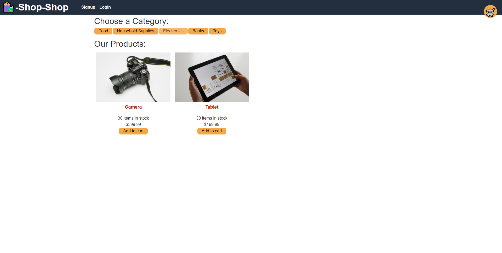
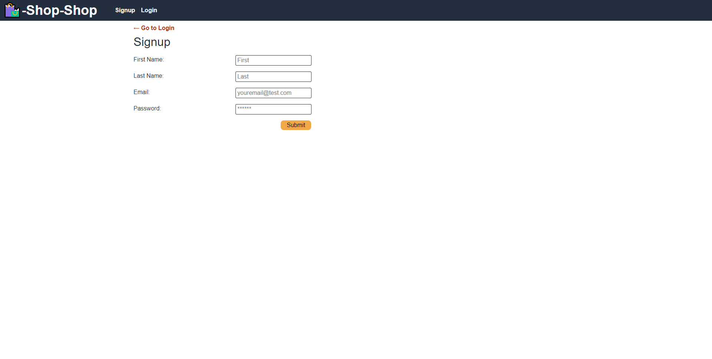
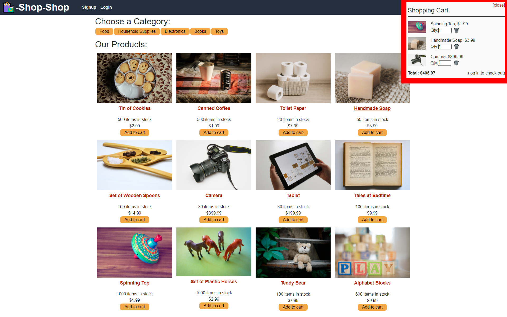
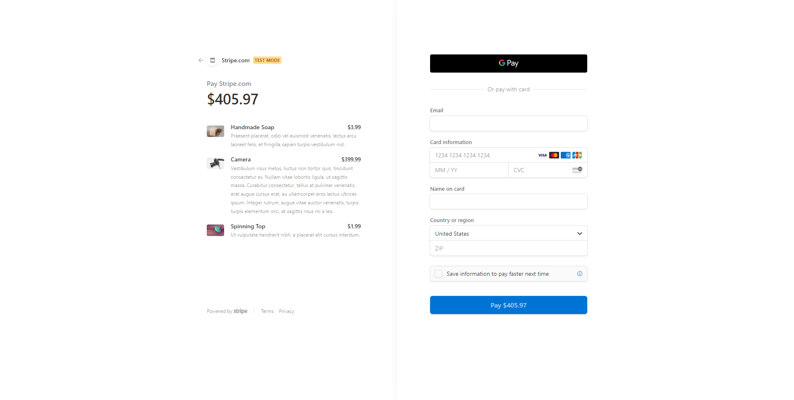

<h1 align="center">Redux E-Commerce Platform</h1>

## Description

  This is a refactor of the 'Shop-Shop' example e-commerce platform provided in the curriculum of Northwestern University's Full-Stack Web Development Boot Camp.

  In the base code, the app uses React's built-in Context API to manage global state, but I refactored it to use the open-source JavaScript library & state container, Redux.

  **Built Using:**
  
    - MongoDB
    - Express.js
    - React.js
    - Node.js
    - Stripe
    - Redux
      - React-Redux

## Table of Contents

  * [Installation](#installation)

  * [Demo](#demo)

  * [Purpose](#purpose)

  * [Contributing](#contributing)

  * [Questions](#questions)

## Installation

  1. Download the repository zip folder using the 'Code' dropdown.
  2. Run `npm i` or `npm install` on the directory.
  3. Run `npm run develop` on the same directory to have both server and client running at the same time.

## Demo

  **Here are some screencaps demonstrating the functionality:**

  Users can browse by category on the home page to find items easier.
  

  Sign up/Log in page, requires an account for checkout.
  

  The shopping cart can be accessed at any time and the checkout button only appears when a user is signed in.
  

  Shop Shop uses Stripe as a simple and secure way to complete *test* order payments. Users can test it out by using a fake credit card number `4242 4242 4242 4242`. The rest of the payment info can be anything.
  

## Purpose

  `AS a senior engineer working on an e-commerce platform` 
  `I WANT my platform to use Redux to manage global state instead of the Context API` 
  `SO THAT my website's state management is taken out of the React ecosystem`

  Often times junior-level programmers are tasked with taking an existing, perfectly working app and have to make it do the same thing but more efficiently. This was solid practice for doing just that, and practice like this gives me a good idea where to start in future projects like this.

## Contributing
  
  All changes to the starter code were done by me, feel free to look through and see if there was anything I missed, or an outdated package!

## Questions

  Find me on GitHub: [jdono100](https://github.com/jdono100) ←_←

  Or send me an email: 📤 [jareddonovan2021@u.northwestern.edu](mailto:jareddonovan2021@u.northwestern.edu) 📥
